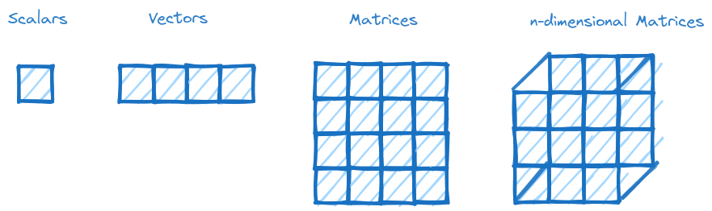

# Learn-pytorch

This is a beginner course for those who want to rapidly learn PyTorch and progress from a beginner to an intermediate level. So, let's get started :muscle:

A research deep learning framework developed by Meta, PyTorch is an open-source platform used by big companies such as Tesla and Microsoft. One of the most interesting that PyTorch has the ability to run code accelerated on a GPU. Additionally, PyTorch offers plenty of pre-built learning models hosted on their website( yyou can find TorchHub [here](https://pytorch.org/hub/)).

PyTorch provides a wide range of tools that cater to the machine learning life cycle, including data preprocessing, model development, and model deployment.

## Table of Contents

- [Tensors](#tensors)
 
## Tensors

In machine learning, tensors are defined as multi-dimensional arrays of numbers. Tensors can represent scalars, vectors, matrices, and n-dimensional matrices. They provide a way to represent and store data, enabling fast mathematical operations specifically for neural network. For a more detailed understanding of tensors, please visit this [YouTube video](https://www.youtube.com/watch?v=L35fFDpwIM4) presented by Josh Starmer (BAM!) .

*     Scalars: Tensors of rank zero 
*     Vectors: Tensors of rank one .
*     Matrices: Tensors of rank two 
*     N-dimensional matrices: Tensors of rank higher than 2. 
