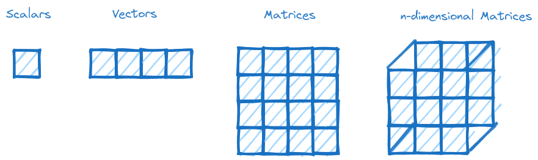

# Learn-pytorch

This is a beginner course for those who want to rapidly learn PyTorch and progress from a beginner to an intermediate level. So, let's get started :muscle:

A research deep learning framework developed by Meta, PyTorch is an open-source platform used by big companies such as Tesla and Microsoft. One of the most interesting that PyTorch has the ability to run code accelerated on a GPU. Additionally, PyTorch offers plenty of pre-built learning models hosted on their website( yyou can find TorchHub [here](https://pytorch.org/hub/)).

PyTorch provides a wide range of tools that cater to the machine learning life cycle, including data preprocessing, model development, and model deployment.

## Table of Contents

- [Tensors](#tensors)
- [Reproducibility](#reproducibility)
 
## Tensors

In machine learning, tensors are defined as multi-dimensional arrays of numbers. Tensors can represent scalars, vectors, matrices, and n-dimensional matrices. They provide a way to represent and store data, enabling fast mathematical operations specifically for neural network. For a more detailed understanding of tensors, please visit this [YouTube video](https://www.youtube.com/watch?v=L35fFDpwIM4) presented by Josh Starmer.

* **Scalars**: Tensors of rank zero.
* **Vectors**: Tensors of rank one.
* **Matrices**: Tensors of rank two.
* **N-dimensional matrices**: Tensors of rank higher than 2. 

## Reproducibility

> "Reproducibility, closely related to replicability and repeatability, is a major principle underpinning the scientific method. For the findings of a study to be reproducible means that results obtained by an experiment or an observational study or in a statistical analysis of a data set should be achieved again with a high degree of reliability when the study is replicated". [wikipedia](https://en.wikipedia.org/wiki/Reproducibility)

In a simpler way, in deep learning, we know that our neural network is initialized with random numbers to represent data patterns. We then apply tensor operations to update and improve these numbers. Thus, we can agree that randomness is valuable and powerful. However, the question arises: what should we do if we want to conduct reproducible experiments that can be shared with the public or friends? Since we always start with random numbers, the results will not be the same each time. How can we avoid this ? :confused:

The main idea :bulb: here is to reduce the randomness. In other words, we will begin with random numbers, but they will always be the same random numbers whenever we run the code. This concept is known as pseudorandomness. For more detailed information, please refer to [wikipedia](https://en.wikipedia.org/wiki/Pseudorandomness)

In PyTorch, the concept of a random seed is used to address pseudorandomness.
